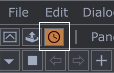
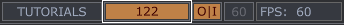
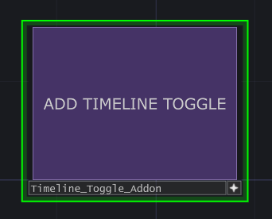
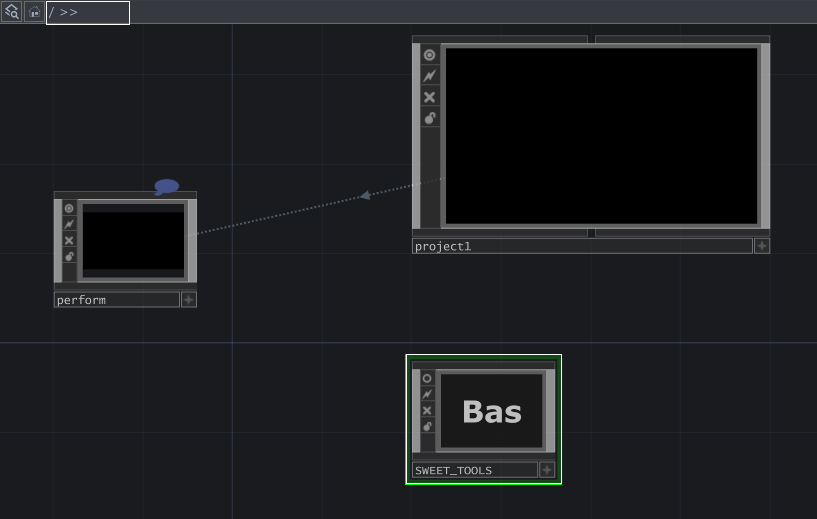
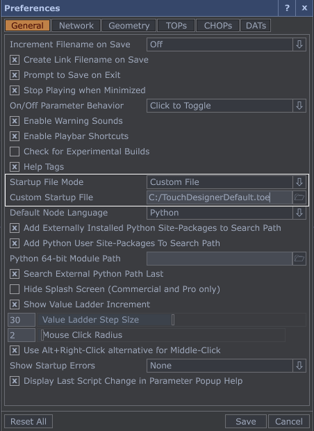

## Description

The timeline takes up too much space, so I made a small addon that adds a toggle for it on the top bar, right next to the "*Palette*" button.

When the timeline is hidden, a display appears on the top bar next to the "*Tutorial*" button. It shows the current frame and playback state, and you can click it to toggle playback.

The timeline toggle persists after restarting in your project, but not on every TouchDesigner startup. If you want the timeline toggle to load automatically when TouchDesigner starts, see the "[How to make it permanent](#how-to-make-it-permanent)" section. Note that it won't be added when opening third-party projects, but you can add it manually.

## Installation

1. Download "*Timeline_Toggle_Addon.tox*" from [Releases](../../releases).

2. Drag and drop the file into your TouchDesigner project.

3. Click "ADD TIMELINE TOGGLE".

4. You can delete this button now — you don't need it anymore.  

<mark>NOTE:</mark> The timeline toggle will stay after a restart, but only in the project you added it to. To have it load automatically when opening TouchDesigner, check the "[How to make it permanent](#how-to-make-it-permanent)" section.

## Removal

For convenience, all my addons are stored in the project root (/) inside a node called SWEET_TOOLS (BaseCOMP). To disable "*Timeline Toggle addon*", simply delete it from the SWEET_TOOLS node and restart TouchDesigner.

## How to make it permanent

The preferences allow you to specify a custom startup file, and we'll take advantage of this feature.

1. Launch TouchDesigner with a blank project.

2. Install the "*Timeline Toggle addon*"

3. Save the project.

4. Navigate to Preferences, select "*Startup File Mode: Custom File*", and set the "*Custom Startup File*" path to your saved project.

That's it! From now on, the timeline toggle will be loaded automatically whenever you start TouchDesigner.
